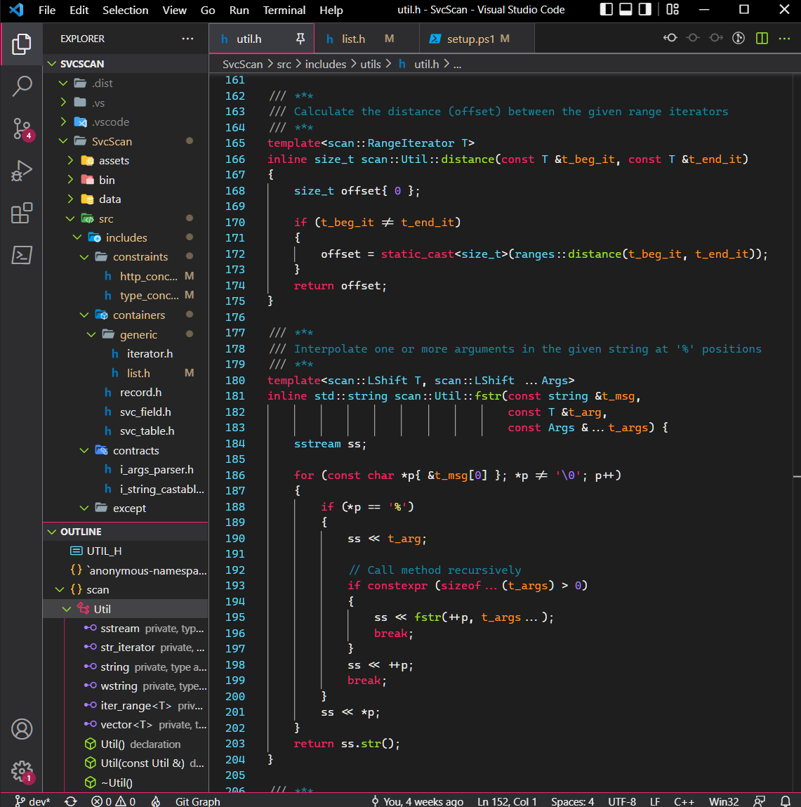
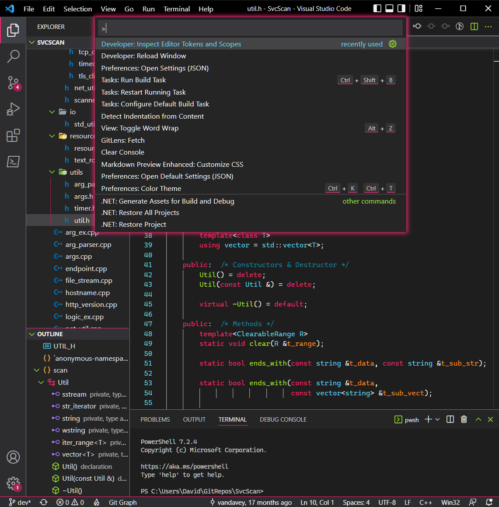
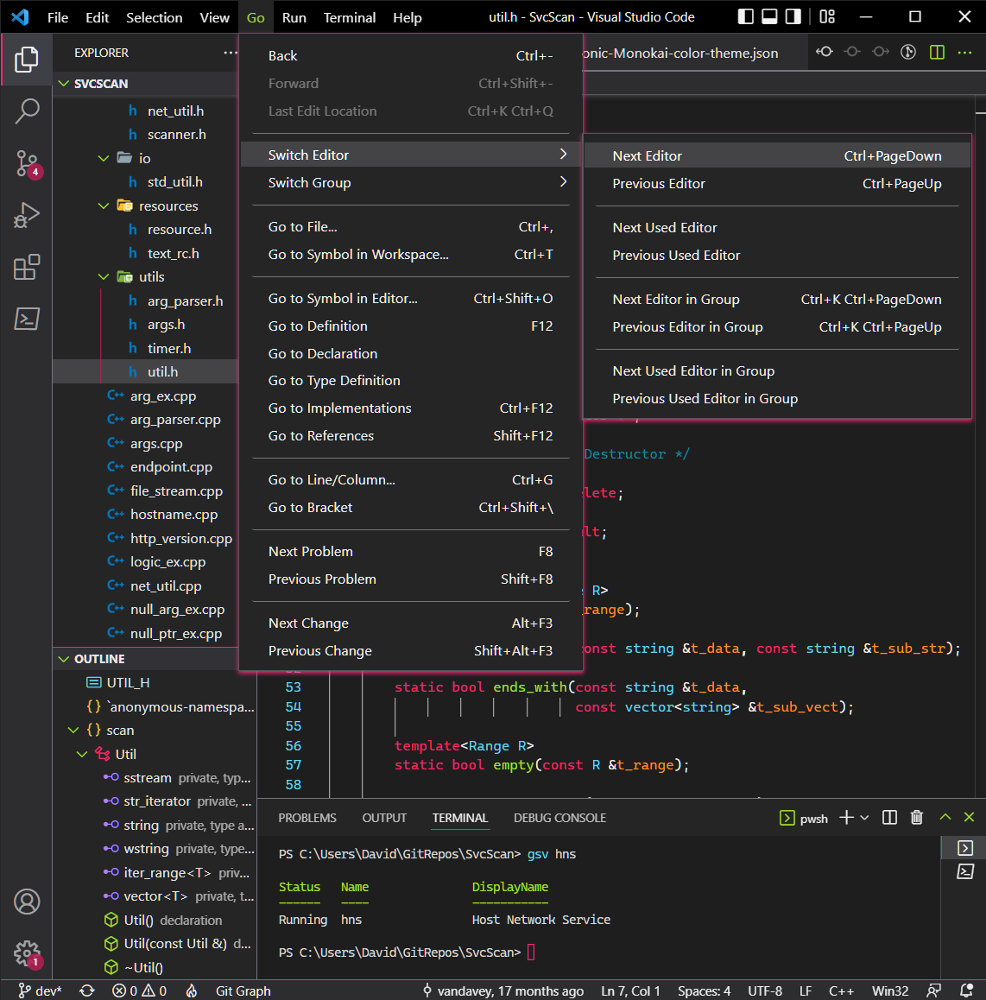

# ChronicMonokai

[VSCode](https://code.visualstudio.com/) editor and syntax
theme inspired by the Monokai color scheme.

***

## Installation

1) Copy and paste the extracted `chronic-monokai` subdirectory to the
   resolved location of `<user home>/.vscode/extensions`.
    > *Note:* The new path of `chronic-monokai` should be
      `<user home>/.vscode/extensions/chronic-monokai`
2) Restart all running instances of [VSCode](https://code.visualstudio.com/).
3) Activate the theme by selecting *Chronic-Monokai* in the
   *Preferences: Color Theme* settings dropdown list.

***

## Previews

### Code Editor

    

### Command Palette

    

### Menus

    

## Remarks

* Semantic highlighting must be enabled in user settings
  for Chronic-Monokai to work properly.

***

## Copyright & Licensing

The ChronicMonokai source code is available
[here](https://github.com/vandavey/ChronicMonokai)
and licensed under the [MIT license](LICENSE.md).
